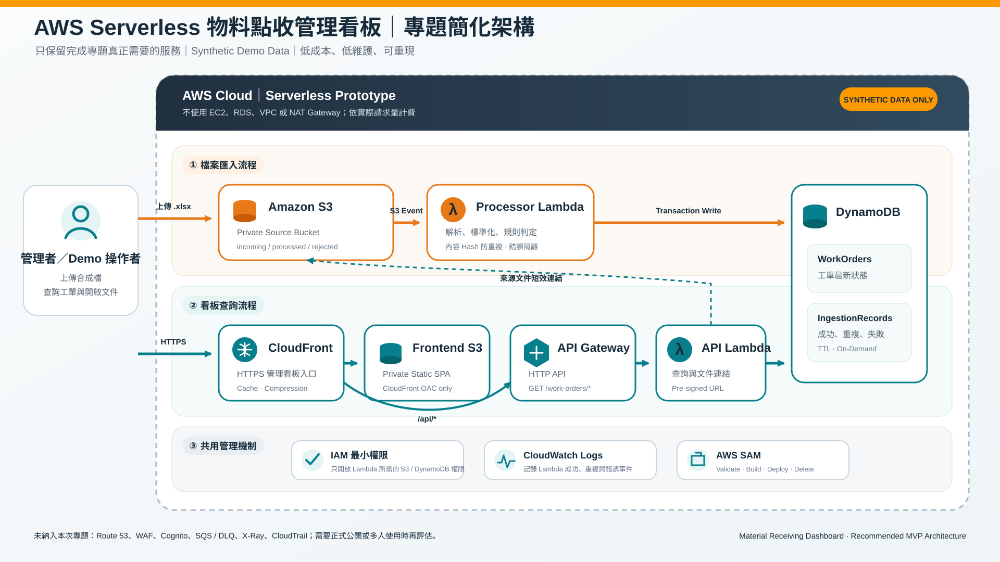

# AWS Material Receipt Dashboard

以 AWS Serverless 架構建立的物料點收示範系統。它將 Excel 檔案匯入問題抽象化為可重建的流程：檔案進入私有 S3 後，自動觸發 Lambda 解析、規則判定、資料品質檢查、DynamoDB 保存，再由 HTTP API 與 CloudFront 看板呈現結果。

> 本 Repository 僅使用 Synthetic Demo Data，不含公司資料、個人資料、AWS 憑證、實際帳號資訊或既有雲端端點。



## 功能

- 新舊 Excel 格式解析後轉為統一資料模型。
- 依缺料、額外 PN、未完成、數量差異與實點差異判定工單結果。
- 使用內容雜湊避免同一檔案重複匯入。
- 損壞或格式不符的檔案會移入 `rejected/`，留下可追溯的結構化日誌。
- 看板將 PN 覆蓋率、點收結果與資料品質分開呈現。
- API 不公開來源檔內部位置；需要查看文件時才產生短效連結。

## 架構

`Synthetic XLSX → Private S3 → Processor Lambda → DynamoDB → HTTP API → CloudFront Dashboard`

AWS SAM 範本會建立：私有來源 S3、私有前端 S3、CloudFront、兩張 DynamoDB 表、Processor Lambda、API Lambda、HTTP API、IAM 權限與 CloudWatch Log Group。

## 專案結構

```text
apps/dashboard/        Dashboard、Lambda Handler、共用規則與自動測試
infrastructure/aws/    AWS SAM / CloudFormation 範本
synthetic-data/        合成 XLSX 範例與產生器
docs/architecture/     架構與資料模型設計
docs/deployment/       部署、設定、驗證、清理與資源盤點
scripts/               本機驗證與前端發布腳本
```

## 本機驗證

```powershell
cd apps/dashboard
pnpm install --frozen-lockfile
pnpm test
pnpm run build:static
```

如需驗證完整 SAM 範本，請由專案根目錄執行：

```powershell
.\scripts\Build-AwsPrototype.ps1
```

## 部署與驗證

請依序閱讀：

1. [設定說明](docs/deployment/configuration.md)
2. [部署流程](docs/deployment/deploy.md)
3. [驗證清單](docs/deployment/verification.md)
4. [資源盤點](docs/aws-resource-inventory.md)
5. [清理流程](docs/deployment/teardown.md)

## 安全與限制

- 請勿將 `.env`、AWS credentials、公司來源檔、真實工單或正式環境網址提交到 Git。
- 範本預設為訓練用 Demo 環境，CORS 與無登入設計不可直接沿用到正式系統。
- 不建議長期公開可寫入的 Demo API；需要 Live Demo 時，應另外補上身分驗證、來源限制、限流與費用防護。

## 授權

本專案採用 [MIT License](LICENSE)。
